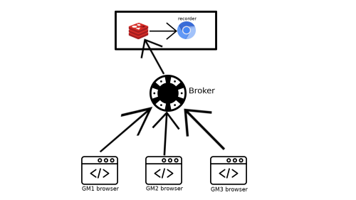

# Field Broker for Roll2O recording

This project is a gateway between the Client and the [Roll20-streaming-client](https://github.com/SoTrxII/roll20-streaming-client).
It receives the recordable players (GMs) relative position in the field canvas and pass it on to Roll20Recorder.
As there can be multiple GMs in a Roll20 Game, it is possible to switch between recorded GMs.

## Usage



The broker is meant to be used by GM wanting the Roll20 recorder to copy their field position. As there can be
multiple GMs in a single Roll20 game, the broker is choosing one GM (the first to send its field position) and send it
to the recorder.

To easily send the field position to the broker, you can use this gist (See [installation](#installation)):

<script src="https://gist.github.com/SoTrxII/8126926ab32b782ddd5ae96759e715a4.js"></script>

Once loaded into the Roll20 windows, this gist will periodically send the GM position to the broker.
A new icon will also be added to the Roll20 toolbar.


When the broker has chosen a GM, it's camera icon will transform into this one.


To change the recorded GM, a GM can click on its camera icon to ask to take the currently recorded GM place.
  

### API

- POST /
  - Description : Update a player field.
  - Returns : OK_RECORDING if the player is being recorder, OK_STANDY if not.
- POST /disconnect
  - Description : Alert the server that a GM is disconnecting from the Roll20 Game. If another GM is still
    connected to the lobby, it will switch to his perspective. If no such GM exists, it will keep the last known
    position of the disconnected GM.
- POST /takeOver
  - Description: Ask to be recorded. This is used to manually switch between GMs.
- POST /code
  - Description: Only returns the HTTP status code corresponding to the player state
  - Returns : OK_RECORDING if the player is being recorder, OK_STANDY if not.

### Custom HTTP Codes

To allow some feedback to be returned to the client without using web sockets or other convoluted methods, some custom
HTTP codes are used :

- 215 -> OK_STANDBY : Used when the server registered the new field, and informs the client that this field is not the
  one being recorded.
- 216 -> OK_RECORDING: Used when the server registered the new field, and inform the client that this field is the one
  being recorded.

## Installation

```bash
# Either pull the bot from the GitHub registry (requiring login for some reason)
docker login docker.pkg.github.com --username <YOUR_USERNAME>
# The image is 200Mb
docker pull docker.pkg.github.com/sotrx/field-broker/field-broker:latest

# OR build it yourself (from the project's root)
docker build -t docker.pkg.github.com/sotrx/field-broker/field-broker:latest
```

Once the image is pulled/built, run it:

```bash
docker run \
-e REDIS_HOST="<REDIS_DB_URL>" \
-e REDIS_PORT="<REDIS_PORT>" \
-it docker.pkg.github.com/sotrx/field-br/pandora:latest
```

Refer to the [configuration](#configuration) for an explanation of the environment variables.
The server should be up and running !

Next is to expose the server to the Internet. Be aware that the nginx.conf file included only allows CORS request from
**app.roll20.net**.

When the server has been successfully exposed, use it's IP/Url to change the gist top variable `TRACKER_BASE_SERVER_URL`.
```js
const TRACKER_BASE_SERVER_URL = "<YOUR URL HERE>"
```

You can then finally copy/paste the gist into the developers console while on the roll20 editor of 
the game you want to record.

A more clever approach would be host your version of the gist and to fetch it.
```js
// Roll20 has JQuery loaded.
$.get("<CUSTOM_GIST_URL>", null, eval)
```
## Configuration

The only variable needed is redis cluster host and port.

```DotENV
REDIS_HOST=
REDIS_PORT=
```
